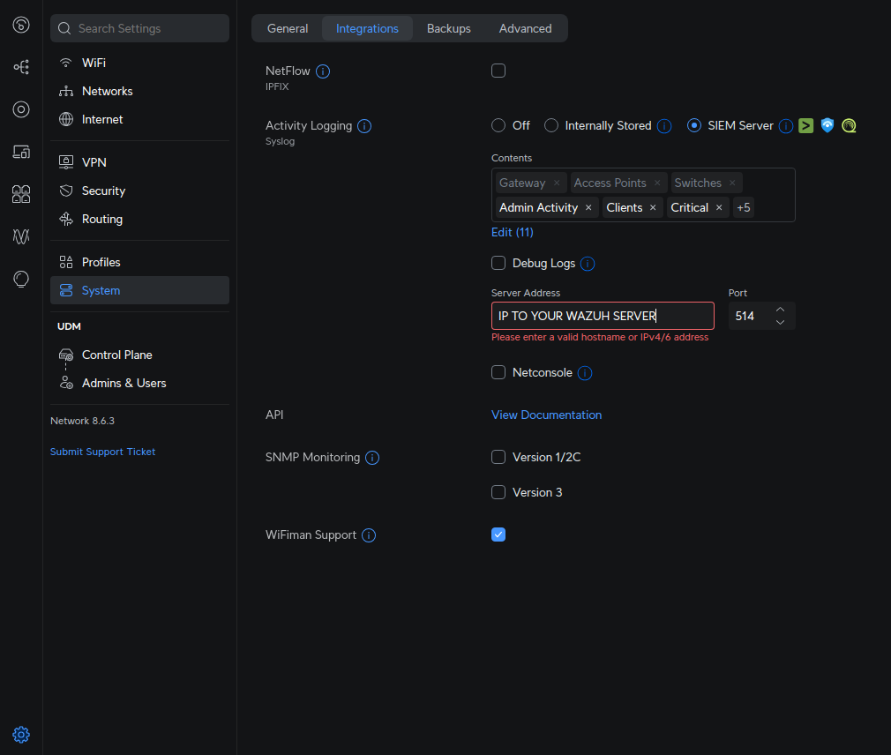

# How to setup Unifi syslog
<div>
    
</div>

* Enable the settings like shown in the picture above
* Add the following configuration under the existing `<remote>` tag in the `ossec.conf` file. Replace `allowed-ips` with the IP range of your UniFi devices:
```xml
  <remote>
    <connection>syslog</connection>
    <port>514</port>
    <protocol>udp</protocol>
    <allowed-ips>192.168.1.0/24</allowed-ips>
  </remote>
  <remote>
    <connection>syslog</connection>
    <port>514</port>
    <protocol>udp</protocol>
    <allowed-ips>192.168.3.1</allowed-ips> <!-- also add the ip of the gateway if you have the wazuh server on a different subnet -->
  </remote>
```
* Verify that you do not have any firewall rules blocking this port on the PC and the firewall
* Make sure port 514 is exposed in the docker file 
* Now you need to save and restart Wazuh and it should now send the syslog to Wazuh 


### Debugging
* To verify that you are receiving data you can set `<logall>` to yes</logall> in the global tag. <b>Remember to disable this after you are done</b>
```xml
  <global>
    <jsonout_output>yes</jsonout_output>
    <alerts_log>yes</alerts_log>
    <logall>yes</logall>
    <logall_json>no</logall_json>
    <email_notification>no</email_notification>
    <smtp_server>smtp.example.wazuh.com</smtp_server>
    <email_from>wazuh@example.wazuh.com</email_from>
    <email_to>recipient@example.wazuh.com</email_to>
    <email_maxperhour>12</email_maxperhour>
    <email_log_source>alerts.log</email_log_source>
    <agents_disconnection_time>10m</agents_disconnection_time>
    <agents_disconnection_alert_time>0</agents_disconnection_alert_time>
  </global>
```
* Now save and restart
* Then check the log `tail -f /var/ossec/logs/archives/archives.log`
